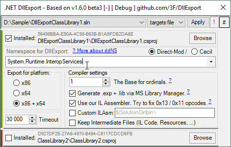
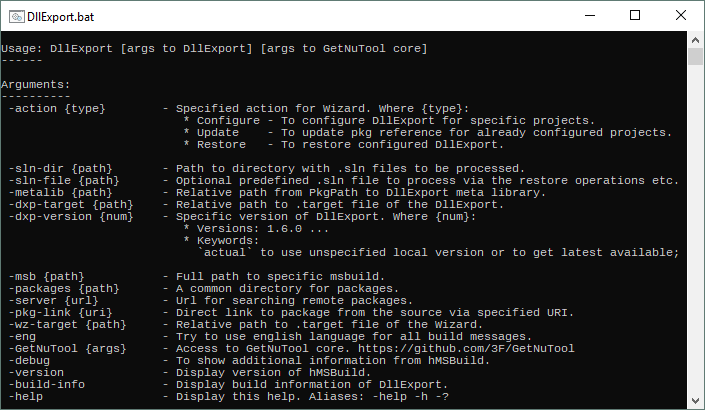

# [DllExport](https://github.com/3F/DllExport)

*.NET DllExport*

```
Copyright (c) 2009-2015  Robert Giesecke
Copyright (c) 2016-2020  Denis Kuzmin < x-3F@outlook.com > GitHub/3F
```

[](https://ci.appveyor.com/project/3Fs/dllexport-ix27o/branch/master)
[](https://github.com/3F/DllExport/releases/latest)
[](https://github.com/3F/DllExport/blob/master/LICENSE)
[](https://www.nuget.org/packages/ILAsm/)
[](https://github.com/jbevain/cecil)
[](https://github.com/3F/MvsSln)
[](https://github.com/3F/GetNuTool)
[](https://github.com/3F/hMSBuild)
[](https://github.com/3F/Conari)

[](https://ci.appveyor.com/project/3Fs/dllexport-ix27o/history)

[`DllExport`](https://3f.github.io/DllExport/releases/latest/manager/)` -action Configure` [[?](#how-to-get-dllexport)]

> [ ***[Quick start](https://github.com/3F/DllExport/wiki/Quick-start)*** ] [ [Examples: C++, C#, Java](https://github.com/3F/DllExport/wiki/Examples) ] 
> -> { **[Wiki](https://github.com/3F/DllExport/wiki)** }

~ ~ ~ --- ~ ~ ~

```csharp
[DllExport]
public static int entrypoint(IntPtr L)
{
    // ... it will be called from Lua script

    lua_pushcclosure(L, onProc, 0);
    lua_setglobal(L, "onKeyDown");

    return 0;
}
```

* For work with **Unmanaged** memory including native or binary data from the heap and binding between .NET and unmanaged native C/C++ etc, use [Conari](https://github.com/3F/Conari)
* For related work with Lua (5.4, 5.3, 5.2, 5.1, ...), use [LuNari](https://github.com/3F/LuNari)

```csharp
[DllExport("Init", CallingConvention.Cdecl)]
// __cdecl is the default calling convention for our library
[DllExport(CallingConvention.StdCall)]
[DllExport("MyFunc")]
[DllExport]
```

We're supporting the following PE modules: Library (**.dll**) and Executable (**.exe**) [[?](https://github.com/3F/DllExport/issues/18)]


v1.2+ provides dynamic definitions of namespaces ([ddNS feature](https://github.com/3F/DllExport/wiki/Quick-start#namespaces)):

```cpp
    Via Cecil or direct modification:

    000005B0                 00 C4 7B 01 00 00 00 2F 00 12 05       .Д{..../...
    000005C0  00 00 02 00 00 00 00 00 00 00 00 00 00 00 26 00  ..............&.
    000005D0  20 02 00 00 00 00 00 00 00 49 2E 77 61 6E 74 2E   ........I.want.   <<<-
    000005E0  74 6F 2E 66 6C 79 00 00 00 00 00 00 00 00 00 00  to.fly..........  <<<-
```

[](https://3f.github.io/DllExport/releases/latest/manager/)
[](https://www.youtube.com/watch?v=QXMj9-8XJnY)


----


[Initially](https://github.com/3F/DllExport/issues/3) the original tool `UnmanagedExports` was distributed by Robert Giesecke as an closed-source tool **under the [MIT License](https://opensource.org/licenses/mit-license.php)**:

* [Official page](https://sites.google.com/site/robertgiesecke/Home/uploads/unmanagedexports) - *posted Jul 9, 2009 [ updated Dec 19, 2012 ]*
* [Official NuGet Packages](https://www.nuget.org/packages/UnmanagedExports)

Now, we will be more open ! all details [here](https://github.com/3F/DllExport/issues/3)

## License

The [MIT License (MIT)](https://github.com/3F/DllExport/blob/master/LICENSE)

.NET DllExport contributors: https://github.com/3F/DllExport/graphs/contributors

## &_

### How does it work

Current features has been implemented through [ILDasm](https://github.com/3F/coreclr/tree/master/src/ildasm) & [ILAsm](https://github.com/3F/coreclr/tree/master/src/ilasm) that prepares the all required steps via `.export` directive ([it's specific directive for ILAsm compiler only](https://github.com/3F/DllExport/issues/45#issuecomment-317802099)).

**What inside ? or how does work the .export directive ?**

Read about format PE32/PE32+, start with grammar from asmparse and move to writer:

```cpp
...
//yacc
if(PASM->m_pCurMethod->m_dwExportOrdinal == 0xFFFFFFFF)
{
  PASM->m_pCurMethod->m_dwExportOrdinal = $3;
  PASM->m_pCurMethod->m_szExportAlias = $6;
  if(PASM->m_pCurMethod->m_wVTEntry == 0) PASM->m_pCurMethod->m_wVTEntry = 1;
  if(PASM->m_pCurMethod->m_wVTSlot  == 0) PASM->m_pCurMethod->m_wVTSlot = $3 + 0x8000;
}
...
EATEntry*   pEATE = new EATEntry;
pEATE->dwOrdinal = pMD->m_dwExportOrdinal;
pEATE->szAlias = pMD->m_szExportAlias ? pMD->m_szExportAlias : pMD->m_szName;
pEATE->dwStubRVA = EmitExportStub(pGlobalLabel->m_GlobalOffset+dwDelta);
m_EATList.PUSH(pEATE);
...
// logic of definition of records into EXPORT_DIRECTORY (see details from PE format)
HRESULT Assembler::CreateExportDirectory()  
{
...
    IMAGE_EXPORT_DIRECTORY  exportDirIDD;
    DWORD                   exportDirDataSize;
    BYTE                   *exportDirData;
    EATEntry               *pEATE;
    unsigned                i, L, ordBase = 0xFFFFFFFF, Ldllname;
    ...
    ~ now we're ready to miracles ~
```

Read also my brief explanations here: [AssemblyRef encoding](https://github.com/3F/DllExport/issues/125#issuecomment-561245575) / [about mscoree](https://github.com/3F/DllExport/issues/45#issuecomment-317802099) / [DllMain & the export-table](https://github.com/3F/DllExport/issues/5#issuecomment-240697109) / [DllExport.dll](https://github.com/3F/DllExport/issues/28#issuecomment-281957212) / [ordinals](https://github.com/3F/DllExport/issues/8#issuecomment-245228065) ...

### How to get DllExport

[**`tl;dr`: put this inside solution folder, then click it there.**](https://3f.github.io/DllExport/releases/latest/manager/)

Since v1.6+ have no official support of NuGet clients ([[?](https://github.com/3F/DllExport/wiki/DllExport-Manager-Q-A)]), you need just use [this](https://3f.github.io/DllExport/releases/latest/manager/) inside your solution folder. **Wiki:** [ [Quick start](https://github.com/3F/DllExport/wiki/Quick-start) ]

Get our manager (~19 Kbytes) from any **trusted** place. Official [GHR](https://github.com/3F/DllExport/releases/latest) is recommended. But you can also get it from official packages via NuGet server [](https://www.nuget.org/packages/DllExport/), etc.

[ **[Documentation](https://github.com/3F/DllExport/wiki/DllExport-Manager)** ]

[](https://github.com/3F/DllExport/wiki/DllExport-Manager#console)

Other way:

* `gnt /p:ngpackages="DllExport"` [[?](https://github.com/3F/GetNuTool)]
    * [GetNuTool](https://github.com/3F/GetNuTool): `msbuild gnt.core /p:ngpackages="DllExport"` or [`gnt`](https://3F.github.io/GetNuTool/releases/latest/gnt/)` /p:ngpackages="DllExport"`
* (deprecated) NuGet PM: `Install-Package DllExport`
* (deprecated) NuGet Commandline: `nuget install DllExport`
* GHR Stable: [/releases](https://github.com/3F/DllExport/releases) [ [latest stable](https://github.com/3F/DllExport/releases/latest) ]
* CI builds: [`/artifacts` page](https://ci.appveyor.com/project/3Fs/dllexport-ix27o/history) ( [old CI](https://ci.appveyor.com/project/3Fs/dllexport/history) ) or find `🎲 CI build` on [GitHub Releases](https://github.com/3F/Dllexport/releases) page.

### How to Build .NET DllExport

Just use build.bat if you need final binaries (NuGet package as `DllExport.<version>.nupkg`, Manager, zip-archives, and others).

```batch
.\build
```

Part of this build scripts works via vssbe ([?](https://github.com/3F/DllExport/issues/31#issuecomment-294231378)) and for build via console (including CI etc.) uses [CIM](https://www.nuget.org/packages/vsSolutionBuildEvent/) version of this. You do not need anything else, just type `build`.

For Visual Studio use this [vsix version for IDE](https://visualstudiogallery.msdn.microsoft.com/0d1dbfd7-ed8a-40af-ae39-281bfeca2334/)

### How to Debug

Wizard through MSBuild, for example:

```
C:\Windows\Microsoft.NET\Framework\v4.0.30319\MSBuild.exe
```

Arguments:

```bash
"net.r_eg.DllExport.Wizard.targets" /p:wRootPath="<...>" 
/p:wSlnFile="<SolutionFile_for_debugging>.sln" /p:wAction="Configure" 
/p:wPkgPath=packages/DllExport<version>
```

Working directory:
```
<path_to>\packages\DllExport<version>\tools
```

DllExport.MSBuild, for example:

```
C:\Program Files (x86)\MSBuild\14.0\Bin\MSBuild.exe
```

Arguments:

```bash
"<path_to_SolutionFile_for_debugging>.sln" /t:Build /p:Configuration=<Configuration>
```

use additional `Diagnostic` key to msbuild if you need more details:
```bash
"<SolutionFile>.sln" /verbosity:Diagnostic /t:Rebuild /p:Configuration=<Configuration>
```

Now you can debug at runtime.

### coreclr ILAsm / ILDasm

We're using **our custom versions on coreclr** specially for our .NET DllExport project - https://github.com/3F/coreclr

This helps to avoid some problems ([like this](https://github.com/3F/DllExport/issues/125#issuecomment-561245575), or [this](https://github.com/3F/DllExport/issues/17)) and more...

*To build minimal version (it will not include all components as for original coreclr repo):*

* Restore git submodule or use repo: https://github.com/3F/coreclr.git

```bash
git submodule update --init --recursive
```

*Make sure that you have installed [CMake](https://cmake.org/download/), then build simply:*

```bash
build-s -all -x86 -x64 Release
```

or use
```bash
build-coreclr-ilasm-x64.cmd
build-coreclr-ilasm-x86+x64.cmd
```

*You can also use our compiled versions:*

* [](https://www.nuget.org/packages/ILAsm/)

### Donation

Please note again, the [UnmanagedExports](https://www.nuget.org/packages/UnmanagedExports) was created by Robert Giesecke. You need [visit his page](https://sites.google.com/site/robertgiesecke/Home/uploads/unmanagedexports).

But this repository [**does not related**](https://github.com/3F/DllExport/issues/87#issuecomment-438576100) to Robert and generally still being developed by [GitHub/3F](https://github.com/3F) developer (Follow the news: [ [GitHub](https://github.com/3F) ]; [ [twitter](https://twitter.com/GitHub3F) ]). 

If something is helpful from *3F/DllExport,* donations are welcomed, and thanks !

[ [ ☕ Donate ](https://3F.github.com/Donation/) ]
